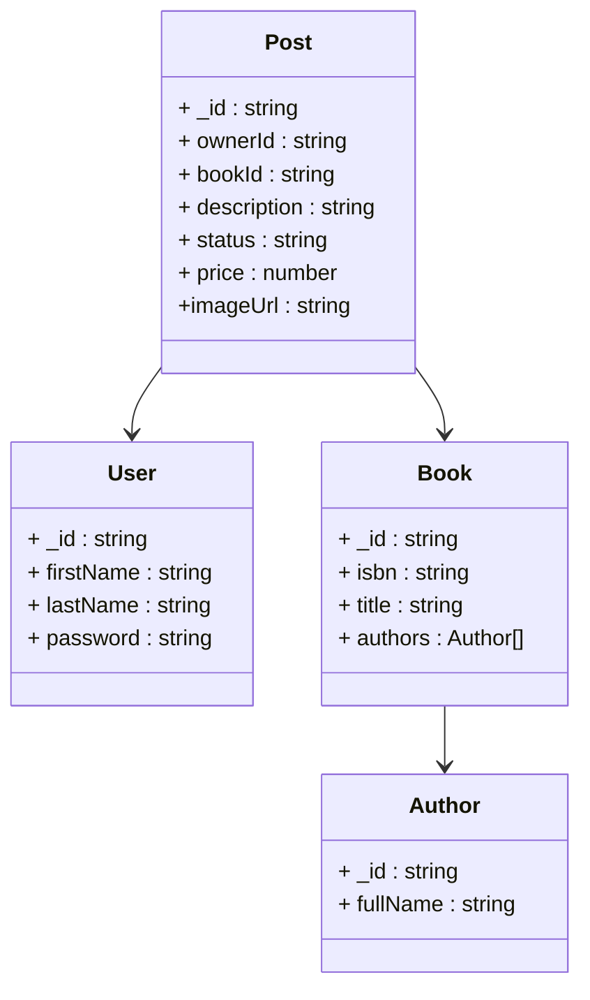

```mermaid
classDiagram
class Post{
+ _id : string
+ ownerId : string
+ bookId : string
+ description : string
+ status : string
+ price : number
+imageUrl : string
}

class User{
+ _id : string
+ firstName : string
+ lastName : string
+ password : string
}


class Book{
+ _id : string
+ isbn : string
+ title : string
+ authors : Author[]
}

class Author{
+ _id : string
+ fullName : string
}

Post --> User
Post --> Book
Book --> Author

```
