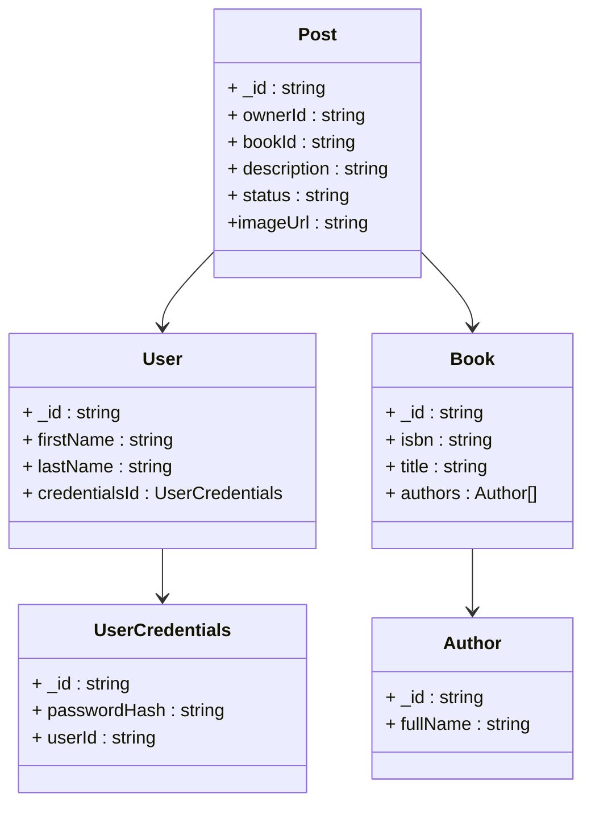

```mermaid
classDiagram
class Post{
+ _id : string
+ ownerId : string
+ bookId : string
+ description : string
+ status : string
+imageUrl : string
}

class User{
+ _id : string
+ firstName : string
+ lastName : string
+ credentialsId : UserCredentials
}

class UserCredentials{
+ _id : string
+ passwordHash : string
+ userId : string
}

class Book{
+ _id : string
+ isbn : string
+ title : string
+ authors : Author[]
}

class Author{
+ _id : string
+ fullName : string
}

Post --> User
Post --> Book
User --> UserCredentials
Book --> Author

```
